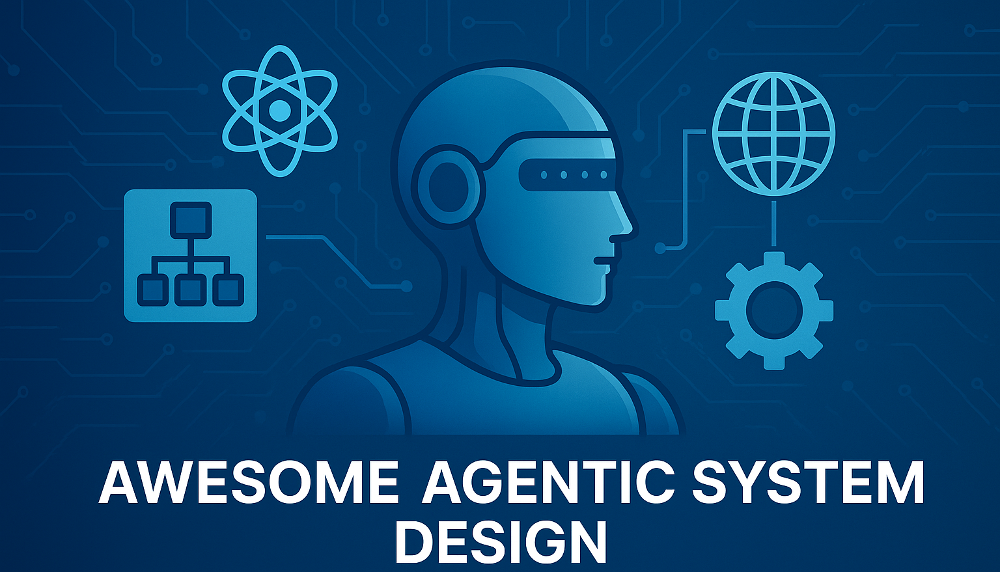

  

# 🌟 Awesome Agentic System Design
A curated collection of resources for **designing, evaluating, and deploying agentic AI systems**—covering architecture patterns, frameworks, safety considerations, and real-world applications.

---

## 📝 Motivation
AI agents are quickly moving from research prototypes to **real-world applications**, and with that shift comes a new challenge: **agentic system design**.  

Just as *machine learning system design* became a must-have skill for engineers and researchers, **agentic system design** is poised to be the next big area of demand. Companies are already looking for people who can reason about how agents should **plan, act, use tools, and collaborate in complex environments**.  

This repository helps you stay ahead of the curve—bringing together the most useful **resources, frameworks, and design patterns** to sharpen your skills for **future agentic system design interviews**.

---

## 📚 Resources

### 🔹 Industry Guides & Whitepapers

- **IBM x Anthropic** — [Architecting Secure Enterprise AI Agents with MCP](https://www.ibm.com/downloads/documents/us-en/1443d5dd174f42e6)  
  *Enterprise-focused blueprint for building secure AI agents using the Model Context Protocol (MCP).*

- **Google** — [AI Whitepaper: Agents](https://ppc.land/content/files/2025/01/Newwhitepaper_Agents2.pdf)  
  *Google’s vision on agent capabilities and their role in next-generation AI systems.*

- **Antonio Gulli (Google)** - [Agentic Design Patterns: A Hands-On Guide to Building Intelligent Systems](https://docs.google.com/document/d/1rsaK53T3Lg5KoGwvf8ukOUvbELRtH-V0LnOIFDxBryE/preview?ref=ppc.land&tab=t.0)

- **Databricks** — [Agent System Design Patterns](https://docs.databricks.com/aws/en/generative-ai/guide/agent-system-design-patterns)  
  *Patterns for designing, orchestrating, and scaling agents in enterprise data/AI workflows.*

- **OpenAI** — [A Practical Guide to Building Agents](https://cdn.openai.com/business-guides-and-resources/a-practical-guide-to-building-agents.pdf?utm_source=chatgpt.com)  
  *Hands-on playbook for constructing agent workflows, planning strategies, and evaluation.*

- **Anthropic** — [Building effective agents](https://www.anthropic.com/engineering/building-effective-agents)  
  *Practical advice for developers on building effective agents*

- **Vectorize** — [Designing Agentic AI Systems (Series)](https://vectorize.io/blog/designing-agentic-ai-systems-part-1-agent-architectures)  
  *Multi-part blog series introducing agent architectures, design considerations, and real-world use cases.*

- **MongoDB** — [7 Practical Design Patterns for Agentic Systems](https://www.mongodb.com/resources/basics/artificial-intelligence/agentic-systems?utm_source=chatgpt.com)  
  *Seven practical design patterns for agentic systems that have implemented in real-world use cases.*

### 📚 Research Papers

- [Weak-for-Strong: Training Weak Meta-Agent to Harness Strong Executors](https://arxiv.org/pdf/2504.04785)
- [MetaAgent: Automatically Constructing Multi-Agent Systems Based on Finite State Machines](https://arxiv.org/abs/2507.22606)
- [AFlow: Automating Agentic Workflow Generation](https://arxiv.org/abs/2410.10762)
- [FlowReasoner: Reinforcing Query-Level Meta-Agents](https://arxiv.org/abs/2504.15257)
  
### 🤖 Agentic Frameworks

- [Accenture AI Refinery SDK](https://sdk.airefinery.accenture.com/ai_refinery_101/)
- [AG2: Open-Source AgentOS for AI Agents](https://github.com/ag2ai/ag2)
- [Agent S: Use Computer Like a Human](https://github.com/ag2ai/ag2)
- [AgentScope: Agent-Oriented Programming for Building LLM Applications](https://github.com/agentscope-ai/agentscope)
- [AutoGen: A framework for building AI agents and applications](https://microsoft.github.io/autogen/stable//index.html)
- [Claude Agent SDK](https://docs.claude.com/en/api/agent-sdk/overview)
- [MetaGPT: The Multi-Agent Framework](https://github.com/FoundationAgents/MetaGPT)
- [Microsoft Agent Framework](https://github.com/microsoft/agent-framework)
- [Microsoft 365 Agents SDK](https://learn.microsoft.com/en-us/microsoft-365/agents-sdk/agents-sdk-overview?tabs=csharp)
- [OpenAI Agents SDK](https://openai.github.io/openai-agents-python/)
- [OpenAI Agent Builder](https://platform.openai.com/docs/guides/agent-builder)

## 🤝 Contributing
Have a resource, paper, or framework that belongs here?  
Feel free to **open a PR** and help grow the ecosystem of **agentic system design**.

---

